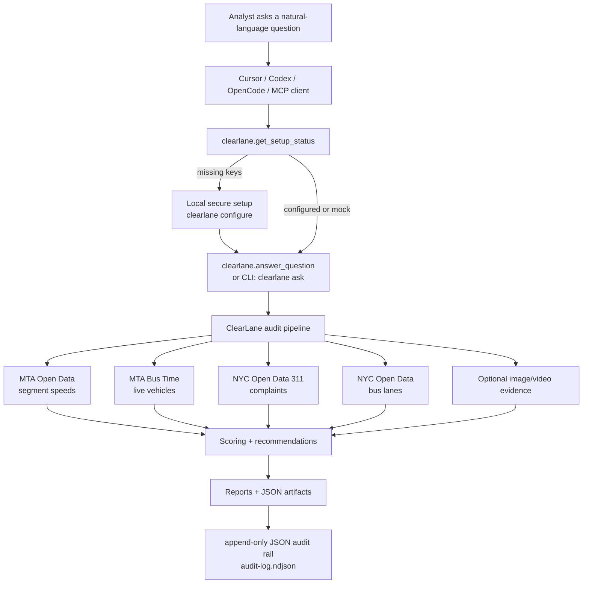
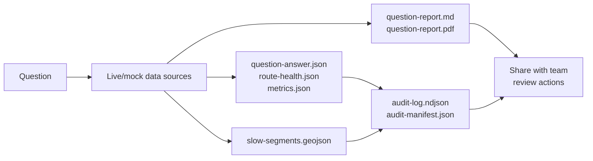

# ClearLane MCP

[](https://www.npmjs.com/package/clearlane-mcp)
[](https://www.npmjs.com/package/clearlane-mcp)
[](./LICENSE)
[](https://www.npmjs.com/package/clearlane-mcp)
[](https://github.com/roshaninfordham/clearlane/actions/workflows/ci.yml)
[](https://github.com/roshaninfordham/clearlane)

Audit-ready bus reliability investigations from MTA + NYC Open Data + optional vision evidence.

ClearLane MCP is an npm-installable CLI and MCP stdio server for civic technologists, agency analysts, and hackathon teams investigating slow NYC bus corridors. It combines MTA route speed data, NYC Open Data, 311 complaints, optional image/video evidence, transparent scoring, and an append-only hash-chained audit ledger.

ClearLane is not a generic chatbot. It is an MCP-enabled investigation workflow for transit reliability.

## Demo Pitch

ClearLane turns scattered MTA, Bus Time, NYC Open Data, 311, and optional camera evidence into an audit-ready action plan for targeted bus reliability interventions. In a live M15 weekday AM demo, ClearLane can identify critical slow segments, attach complaint and bus-lane context, and produce shareable Markdown/PDF reports plus a JSON audit rail.

## System Architecture



## Output Flow



## Package Links

- npm package: [clearlane-mcp](https://www.npmjs.com/package/clearlane-mcp)
- GitHub repository: [roshaninfordham/clearlane](https://github.com/roshaninfordham/clearlane)
- Download stats: [npm downloads](https://www.npmjs.com/package/clearlane-mcp)
- License: [MIT](./LICENSE)
- Architecture diagram: [docs/architecture.md](./docs/architecture.md)

## Government Problem

NYC buses serve 1.1M+ daily riders, yet 186 of 332 bus lines received D/F grades for speed, bunching, and on-time performance; MTA also notes buses are slowed by double-parking, delivery vehicles, road closures, and traffic.

Today, analysts manually stitch together MTA data, NYC Open Data, 311 complaints, maps, and field evidence; ClearLane MCP turns those disconnected sources into an audit-ready reliability report with bottlenecks, likely causes, evidence, recommendations, and append-only JSON logs.

Bus speeds and reliability are hurt by traffic, curb conflicts, double parking, blocked stops, delivery activity, and lane encroachment. Agencies often have relevant APIs, open datasets, 311 complaints, field photos, and analyst knowledge, but the evidence is scattered. ClearLane turns that evidence into a single operational report that answers:

> Why is this route or corridor slow, where are the bottlenecks, what evidence supports the finding, and what operational actions should DOT/MTA consider?

## Why Auditability Matters

Every ClearLane run writes `audit-log.ndjson`, an append-only ledger where each event includes source references, query context, timestamps, claims, confidence, output references, and a SHA-256 hash chain. The companion `audit-manifest.json` records artifact hashes and the final ledger hash so a reviewer can detect tampering.

## Installation

The npm package name is `clearlane-mcp`. The CLI command is `clearlane`; starting with `0.4.2`, `clearlane-mcp` is also provided as a command alias.

Global install, recommended for MCP clients:

```bash
npm install -g clearlane-mcp
clearlane --version
clearlane-mcp --version
```

One-off use without installing globally:

```bash
npx clearlane-mcp --version
npx clearlane-mcp init --client cursor
npx clearlane-mcp init --client opencode
```

Local project install:

```bash
npm install clearlane-mcp
npx clearlane --version
npx clearlane-mcp --version
./node_modules/.bin/clearlane --version
```

If you run `npm install clearlane-mcp` without `-g`, do not expect `clearlane` or `clearlane-mcp` to be available as direct shell commands unless `node_modules/.bin` is on your PATH. Use `npx` or `./node_modules/.bin/...`.

If you installed globally and still get `zsh: command not found: clearlane`, your npm global bin directory is not on PATH:

```bash
npm prefix -g
ls "$(npm prefix -g)/bin"
echo 'export PATH="$HOME/.npm-global/bin:$PATH"' >> ~/.zshrc
source ~/.zshrc
```

Local development from this repo:

```bash
npm install
npm run build
node dist/cli/index.js doctor
```

## First-Time Setup

ClearLane never asks you to paste API keys into Cursor, Codex, OpenCode, or any MCP chat transcript. Configure credentials locally:

```bash
clearlane configure
```

You can skip keys you do not have. ClearLane can still run in mock mode.

Supported credentials:

```bash
MTA_API_KEY=
NYC_OPEN_DATA_APP_TOKEN=
OPENAI_API_KEY=
NY511_API_KEY=
```

Credential resolution order:

1. Process environment variables.
2. ClearLane local credential file in `~/.clearlane/`.
3. Project `.env.local`, only after explicit `clearlane configure --project-env`.
4. Missing.

The local credential fallback uses owner-only file permissions where supported. Values are never printed by `doctor`, `auth status`, MCP tools, reports, or audit logs.

Check setup:

```bash
clearlane auth status
clearlane auth status --json
clearlane doctor
```

## Quickstart

```bash
clearlane init --client cursor
clearlane configure
clearlane ask "Why is the M15 slow during weekday AM reliability?" --out ./output
```

## New User Flow

Install globally:

```bash
npm install -g clearlane-mcp
```

Then these should work:

```bash
clearlane --version
clearlane-mcp --version
clearlane auth status
clearlane doctor
clearlane init --client opencode
```

Example verified output from a macOS zsh shell:

```text
clearlane -> /Users/rs/.npm-global/bin/clearlane
clearlane-mcp -> /Users/rs/.npm-global/bin/clearlane-mcp
version -> 0.4.2
MTA_API_KEY -> present via local-file
NYC_OPEN_DATA_APP_TOKEN -> present via local-file
```

If `clearlane` says `command not found`, add npm's global bin directory to your shell:

```bash
echo 'export PATH="$HOME/.npm-global/bin:$PATH"' >> ~/.zshrc
source ~/.zshrc
```

For OpenCode:

```bash
clearlane init --client opencode
```

Restart OpenCode, then ask your ClearLane prompt. Or run directly:

```bash
clearlane ask "Bus speeds are negatively impacted by cars parked in bus lanes and other bus lane obstructions. NYPD has finite resources to enforce traffic laws. How can we use cameras and other technology to conduct more targeted enforcement or automated enforcement?" \
  --route M15 \
  --borough Manhattan \
  --period weekday_am \
  --out ./demo-output/live-enforcement
```

See outputs here:

```text
demo-output/live-enforcement/
  question-report.md
  question-report.pdf
  question-answer.json
  audit-log.ndjson
  audit-manifest.json
  metrics.json
  route-health.json
  slow-segments.geojson
  recommendations.json
  report.md
  report.pdf
```

Demo mode works with zero API keys:

```bash
clearlane audit --route M15 --borough Manhattan --period weekday_am --mock --out ./output
clearlane ask "What should DOT and MTA review for the M15 weekday AM corridor?" --mock --out ./output
```

Live targeted-enforcement demo:

```bash
clearlane ask "Bus speeds are negatively impacted by cars parked in bus lanes and other bus lane obstructions. NYPD has finite resources to enforce traffic laws. How can we use cameras and other technology to conduct more targeted enforcement or automated enforcement?" --route M15 --borough Manhattan --period weekday_am --out ./demo-output/live-enforcement
```

Local development:

```bash
npm run build
node dist/cli/index.js init --client cursor --local
node dist/cli/index.js audit --route M15 --borough Manhattan --period weekday_am --mock --out ./output
node dist/cli/index.js verify-ledger ./output/audit-log.ndjson
```

## MCP Setup

Cursor:

```bash
clearlane init --client cursor
```

Codex:

```bash
clearlane init --client codex
```

OpenCode:

```bash
clearlane init --client opencode
```

All clients:

```bash
clearlane init --client all
```

Local MCP configs use:

```bash
node ./dist/mcp/server.js
```

## MCP Prompt Example

Use ClearLane MCP to answer: why is the M15 bus route slow during weekday AM reliability?

First check ClearLane setup status. If credentials are missing, do not ask me to paste keys here. Tell me to run `clearlane configure` in my terminal. If I do not have keys yet, run the audit in mock mode.

Generate `report.md`, `report.pdf`, `question-answer.json`, `question-report.md`, `context-cache.json`, `metrics.json`, `route-health.json`, `slow-segments.geojson`, `recommendations.json`, and `audit-log.ndjson`. Include a Mermaid visualization and then verify the audit ledger.

Targeted enforcement prompt:

```text
Use ClearLane to answer this for the M15 weekday AM corridor:
Bus speeds are negatively impacted by cars parked in bus lanes and other bus lane obstructions. NYPD has finite resources to enforce traffic laws. How can we use cameras and other technology to conduct more targeted enforcement or automated enforcement?

Generate a natural-language answer, action points, Mermaid visualization, Markdown/PDF reports, JSON artifacts, and verify the audit ledger.
```

Expected first-run MCP behavior:

1. The agent calls `clearlane.get_setup_status`.
2. If configured, it calls `clearlane.answer_question` or `clearlane.audit_route`.
3. If not configured, it tells the user to run `clearlane configure`.
4. It never asks for API keys in chat or tool parameters.
5. It may offer a mock audit while live credentials are being set up.

## CLI Examples

```bash
clearlane configure
clearlane auth status
clearlane doctor
clearlane init --client cursor
clearlane ask "Why is the M15 slow during weekday AM?" --mock --out ./output
clearlane ask "What are the top action points for M15 bus reliability?" --out ./output
clearlane ask "Bus speeds are negatively impacted by cars parked in bus lanes and other bus lane obstructions. NYPD has finite resources to enforce traffic laws. How can we use cameras and other technology to conduct more targeted enforcement or automated enforcement?" --route M15 --borough Manhattan --period weekday_am --out ./demo-output/live-enforcement
clearlane audit --route M15 --borough Manhattan --period weekday_am --mock --out ./output
clearlane audit --route M15 --borough Manhattan --period weekday_am --out ./output
clearlane audit --route M15 --with-evidence ./input/evidence --out ./output
clearlane analyze-evidence ./input/evidence --out ./output --mock
clearlane report --from ./output/route-health.json --out ./output
clearlane verify-ledger ./output/audit-log.ndjson
clearlane inspect-source --dataset kufs-yh3x --limit 5
```

## MCP Tools

ClearLane exposes a compact MCP tool surface:

- `clearlane.get_setup_status`: report credential status and next setup command.
- `clearlane.configure_help`: explain secure local setup without requesting secrets.
- `clearlane.answer_question`: answer a natural-language transit reliability question using MTA, NYC Open Data, 311, optional evidence, action points, artifacts, and Mermaid.
- `clearlane.audit_route`: run the audit and generate artifacts, or return `needs_configuration`.
- `clearlane.analyze_evidence`: analyze local evidence, or return `needs_configuration` for missing vision credentials.
- `clearlane.generate_report`: regenerate Markdown/PDF reports from artifacts.
- `clearlane.verify_ledger`: verify the audit hash chain.
- `clearlane.doctor`: return setup diagnostics without secret values.

If live credentials are missing and `mock` is not set, MCP tools return a structured result like:

```json
{
  "status": "needs_configuration",
  "summary": "ClearLane needs local credentials for live transit/open-data queries.",
  "nextStep": "Ask the user to run `clearlane configure` in their terminal, or rerun this tool with mock=true."
}
```

## Credential Safety

Acceptable credential flows:

- Environment variables.
- `clearlane configure` local credential storage.
- Explicit project `.env.local` with `clearlane configure --project-env`.
- Mock mode.

Never paste API keys into MCP chat. ClearLane does not log secrets to `audit-log.ndjson`, reports, metrics, MCP responses, or console status output.

## Output Artifacts

```text
output/
  report.md
  report.pdf
  question-answer.json
  question-report.md
  question-report.pdf
  context-cache.json
  metrics.json
  route-health.json
  slow-segments.geojson
  recommendations.json
  audit-log.ndjson
  audit-manifest.json
  evidence/
    analyzed-frame-001.jpg
    analyzed-frame-002.jpg
```

## Privacy Posture

ClearLane does not identify people, read or report license plates, track individuals, infer protected attributes, perform biometric analysis, or make legal/enforcement determinations. Evidence findings are operational and always marked for human review.

Every report states:

> ClearLane is a decision-support tool. Findings are based on available data and optional visual evidence. They require human review before operational, enforcement, or policy action.

## Demo Mode

The demo never requires API keys:

```bash
npm run demo
```

Mock M15 output includes 12 segments analyzed, 3 priority bottlenecks, 5.8 mph lowest observed average speed, 42 relevant 311 complaints, 2 optional vision findings, and 4 recommendations.

## Limitations

- Live public dataset schemas may change; ClearLane uses schema-flexible adapters and falls back to mock data when needed.
- Geo matching is intentionally lightweight for hackathon use.
- Vision evidence is decision support only and requires human review.
- The package is published as `clearlane-mcp` on npm.

## Publishing

Do not publish unless the repo owner explicitly authorizes it and npm credentials are available.

Maintainer local flow:

```bash
npm login
npm whoami
npm run typecheck
npm run lint
npm test
npm run build
npm run pack:dry
npm run publish:dry
npm publish --access public
```

If npm Trusted Publishing is connected to this GitHub repository, use the `Release`
workflow from GitHub Actions. The workflow publishes with provenance using GitHub OIDC
and does not require an `NPM_TOKEN` secret.

## License

MIT
