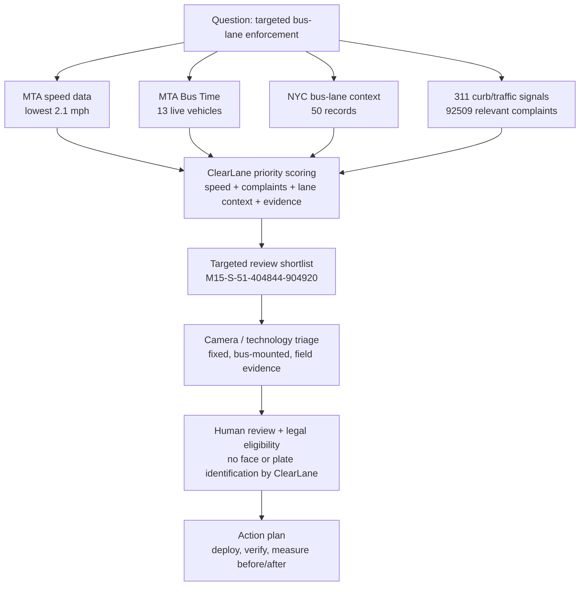

# ClearLane Question Answer

Question: Bus speeds are negatively impacted by cars parked in bus lanes and other bus lane obstructions. NYPD has finite resources to enforce traffic laws. How can we use cameras and other technology to conduct more targeted enforcement or automated enforcement?
Route: M15
Borough: Manhattan
Period: weekday_am
Generated: 2026-06-25T00:57:08.063Z

## Answer

ClearLane recommends targeted, evidence-led enforcement review for M15: start with PIKE ST/MADISON ST to PIKE ST/SOUTH ST, where observed average speed bottoms out at 2.1 mph. Because NYPD and agency enforcement resources are finite, ClearLane should be used as a targeting layer: combine MTA segment speeds, 13 live MTA Bus Time vehicle records, 92509 relevant 311 complaints, 50 bus-lane context records, and optional camera/field evidence to rank where review is most likely to improve bus reliability. For camera and technology deployment, prioritize corridors where low speeds and bus-lane context overlap, then use fixed cameras, bus-mounted/mobile camera evidence, and field observations to triage locations for DOT/MTA/NYPD review. ClearLane should not make enforcement determinations, identify people, or read/report license plates; it should create an auditable shortlist with confidence scores, source queries, and human-review notes before any operational, legal, or automated-enforcement action.

## Demo Pitch

ClearLane turns scattered MTA, Bus Time, NYC Open Data, 311, and optional camera evidence into an audit-ready action plan; this run found 3 priority bottleneck(s), a lowest observed speed of 2.1 mph, and 92509 relevant 311 complaints.

## Visual Summary

## Key Findings

- PIKE ST/MADISON ST to PIKE ST/SOUTH ST is the top enforcement-review candidate: critical severity, 2.1 mph average speed.
  Evidence: bottleneck:M15-S-51-404844-904920, segment:M15-S-51-404844-904920
  Confidence: 0.82
- 92509 relevant 311 complaints were aggregated for curb, parking, traffic, street-condition, and bus-stop context. The largest category is Illegal Parking (67728).
  Evidence: 311:Illegal Parking, 311:Street Condition, 311:Blocked Driveway, 311:Traffic, 311:Bus Stop Shelter Complaint, 311:Bike/Roller/Skate Chronic
  Confidence: 0.78
- 50 bus-lane context records and 13 live MTA Bus Time vehicle records were attached to help target locations and time windows for review.
  Evidence: bus-lane:0035887, bus-lane:0035888, bus-lane:0034654, bus-lane:0034656, bus-lane:0033106, bus-lane:0033108, bus-lane:0165428, bus-lane:0164507, mta_bus_time_vehicle_monitoring
  Confidence: 0.76

## Action Points

- Create a priority enforcement-review shortlist starting with PIKE ST/MADISON ST to PIKE ST/SOUTH ST.
  Reason: This focuses finite enforcement capacity on the segment with the strongest combined speed, bus-lane, complaint, and operational signals.
  Evidence: bottleneck:M15-S-51-404844-904920, segment:M15-S-51-404844-904920
  Confidence: 0.84
- Use cameras and technology as triage: compare fixed bus-lane cameras, bus-mounted/mobile evidence, 311 hotspots, and field observations before deployment.
  Reason: A multi-signal shortlist is more defensible than reacting to isolated complaints or single images.
  Evidence: slow-segments.geojson, route-health.json, bus-lane:0035887, bus-lane:0035888, bus-lane:0034654, bus-lane:0034656, bus-lane:0033106
  Confidence: 0.8
- Schedule DOT/MTA/NYPD human review during the matching service period before any enforcement or automated-enforcement action.
  Reason: ClearLane is decision support; agencies still need to confirm signage, bus-lane geometry, camera eligibility, recurring conditions, and legal authority.
  Evidence: audit-log.ndjson, audit-manifest.json
  Confidence: 0.86
- Measure before/after bus speeds and complaints after a pilot deployment.
  Reason: The same MTA segment-speed and 311 queries can show whether targeted camera or field enforcement improved reliability.
  Evidence: metrics.json, question-answer.json
  Confidence: 0.83

## Data Used

- mta_open_data_segment_speeds (kufs-yh3x)
- nyc_open_data_bus_lanes (ycrg-ses3)
- mta_bus_time_vehicle_monitoring
- nyc_open_data_311 (erm2-nwe9)

## Audit

- Ledger: demo-output/live-enforcement/audit-log.ndjson
- Route-health JSON: demo-output/live-enforcement/route-health.json
- Audit manifest: demo-output/live-enforcement/audit-manifest.json

ClearLane is a decision-support tool. Findings are based on available data and optional visual evidence. They require human review before operational, enforcement, or policy action.
