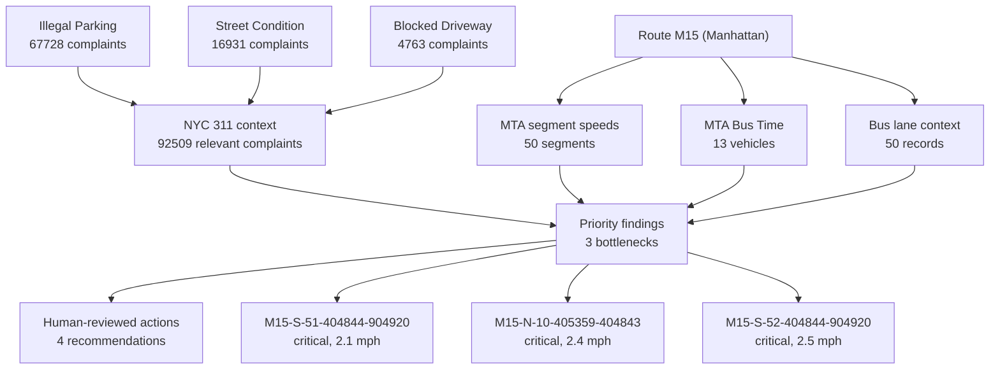

# ClearLane Bus Reliability Audit

Route: M15
Borough: Manhattan
Period: Weekday AM
Generated: 2026-06-25T00:57:08.036Z

## Executive Summary

ClearLane identified 3 priority bottlenecks. The highest-priority segment shows low historical speed, nearby complaints related to curb or traffic issues, and optional visual evidence consistent with possible lane blockage where available. Findings require human review before operational, enforcement, or policy action.

ClearLane is a decision-support tool. Findings are based on available data and optional visual evidence. They require human review before operational, enforcement, or policy action.

## Key Metrics

| Metric | Value |
|---|---:|
| Segments analyzed | 50 |
| Priority bottlenecks | 3 |
| Lowest observed avg speed | 2.1 mph |
| Relevant 311 complaints nearby | 92509 |
| Vision evidence findings | 0 |

## Corridor Signal Map

## Top Bottlenecks

### 1. PIKE ST/MADISON ST to PIKE ST/SOUTH ST

- Segment ID: M15-S-51-404844-904920
- Severity: critical
- Avg speed: 2.1 mph
- Avg travel time: 6.8 min
- Priority score: 53.8
- Confidence: 0.51
- Reason: Average speed of 2.1 mph is below the corridor review threshold.
- Evidence refs: segment:M15-S-51-404844-904920

### 2. PIKE ST/SOUTH  ST to PIKE ST/MADISON ST

- Segment ID: M15-N-10-405359-404843
- Severity: critical
- Avg speed: 2.4 mph
- Avg travel time: 4.0 min
- Priority score: 53.8
- Confidence: 0.51
- Reason: Average speed of 2.4 mph is below the corridor review threshold.
- Evidence refs: segment:M15-N-10-405359-404843

### 3. PIKE ST/MADISON ST to PIKE ST/SOUTH ST

- Segment ID: M15-S-52-404844-904920
- Severity: critical
- Avg speed: 2.5 mph
- Avg travel time: 5.8 min
- Priority score: 53.8
- Confidence: 0.52
- Reason: Average speed of 2.5 mph is below the corridor review threshold.
- Evidence refs: segment:M15-S-52-404844-904920

## Evidence

### Data Sources

- mta_open_data_segment_speeds (kufs-yh3x): MTA Bus Route Segment Speeds
- nyc_open_data_bus_lanes (ycrg-ses3): NYC Open Data Bus Lanes
- mta_bus_time_vehicle_monitoring: MTA Bus Time SIRI vehicle monitoring
- nyc_open_data_311 (erm2-nwe9): source record

### Real-Time MTA Bus Time

- Vehicle records fetched: 13
- Snapshot time: 2026-06-25T00:57:03.274Z

### Bus Lane Context

- 1 AVENUE - Bus Lane - 24 Hours - Route M15 (Manhattan)
- 1 AVENUE - Bus Lane - 24 Hours - Route M15 (Manhattan)
- 1 AVENUE - Bus Lane - 24 Hours - Route M15 (Manhattan)
- 1 AVENUE - Bus Lane - 24 Hours - Route M15 (Manhattan)
- 1 AVENUE - Bus Lane - 24 Hours - Route M15 (Manhattan)
- 1 AVENUE - Bus Lane - 24 Hours - Route M15 (Manhattan)
- 1 AVENUE - Bus Lane - 24 Hours - Route M15 (Manhattan)
- 1 AVENUE - Bus Lane - 24 Hours - Route M15 (Manhattan)
- 1 AVENUE - Bus Lane - 24 Hours - Route M15 (Manhattan)
- 1 AVENUE - Bus Lane - 24 Hours - Route M15 (Manhattan)

### 311 Complaint Hotspots

- Illegal Parking: 67728 complaints near 40.7784, -73.9685
- Street Condition: 16931 complaints near 40.7653, -73.9750
- Blocked Driveway: 4763 complaints near 40.7803, -73.9652
- Traffic: 2468 complaints near 40.7365, -73.9817
- Bus Stop Shelter Complaint: 410 complaints near 40.7735, -73.9676
- Bike/Roller/Skate Chronic: 209 complaints near 40.7649, -73.9740

### Optional Vision Evidence

- No optional image or video evidence findings were included.

## Recommendations

### 1. Field-verify PIKE ST/MADISON ST to PIKE ST/SOUTH ST during weekday AM peak.

- Type: field_verify
- Reason: The top segment combines low historical speed with nearby curb and traffic complaint signals.
- Confidence: 0.82
- Evidence references: bottleneck:M15-S-51-404844-904920, segment:M15-S-51-404844-904920
- Human review: Confirm field conditions before operational action.

### 2. Review bus-lane and camera enforcement eligibility for the priority segment.

- Type: review_bus_lane_enforcement
- Reason: Bus-lane context overlaps with at least one slow segment and optional evidence suggests possible blockage.
- Confidence: 0.74
- Evidence references: bus-lane:0035887, bus-lane:0035888, bus-lane:0034654, bus-lane:0034656, bus-lane:0033106, bus-lane:0033108, bus-lane:0165428, bus-lane:0164507
- Human review: This is not an enforcement conclusion; eligibility must be checked by authorized staff.

### 3. Evaluate nearby loading-zone or curb-management changes to reduce recurring curb conflicts.

- Type: evaluate_loading_zone
- Reason: Relevant 311 complaints and optional visual evidence are consistent with curbside activity affecting bus movement.
- Confidence: 0.71
- Evidence references: 311:Illegal Parking, 311:Street Condition, 311:Blocked Driveway, 311:Traffic, 311:Bus Stop Shelter Complaint, 311:Bike/Roller/Skate Chronic
- Human review: Verify signage, land use, and loading demand before recommending curb changes.

### 4. Re-run ClearLane after any intervention to compare before/after segment speeds.

- Type: compare_before_after
- Reason: A repeatable audit ledger and metrics artifact can support transparent intervention review.
- Confidence: 0.86
- Evidence references: metrics.json, audit-log.ndjson
- Human review: Use comparable dates, days of week, and time periods for before/after review.

## Data Completeness

| Source | Status |
|---|---|
| MTA segment speeds | available |
| MTA real-time Bus Time | available |
| NYC 311 | available |
| Vision evidence | skipped |

## Human Review Checklist

- Verify bus lane geometry.
- Confirm signage and curb regulation.
- Confirm whether observed blockage is recurring.
- Compare before/after speeds after any intervention.

## Audit Appendix

- Ledger: demo-output/live-enforcement/audit-log.ndjson
- Final ledger hash: 9c1ab00818acffecf423eceb5f5203d37affb47597b7b59668625b1270cc0d02
- Ledger SHA-256: 3420d2887539238f28373a2f45cb83459633ce79e4cbe3934e594dc206c7d0b4
- Artifacts: demo-output/live-enforcement/report.md, demo-output/live-enforcement/report.pdf, demo-output/live-enforcement/metrics.json, demo-output/live-enforcement/route-health.json, demo-output/live-enforcement/slow-segments.geojson, demo-output/live-enforcement/recommendations.json, demo-output/live-enforcement/audit-log.ndjson
