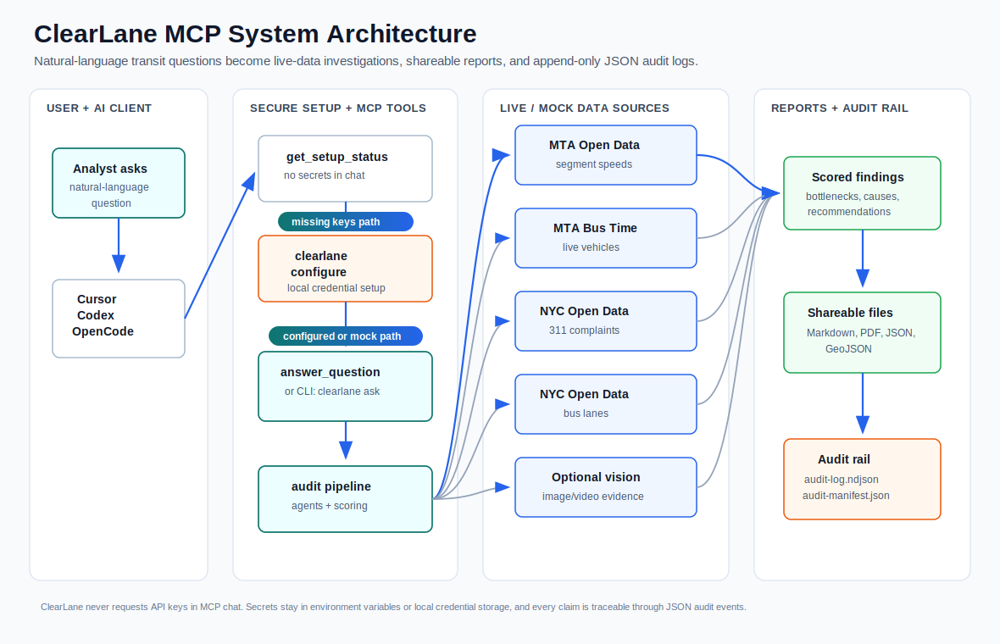
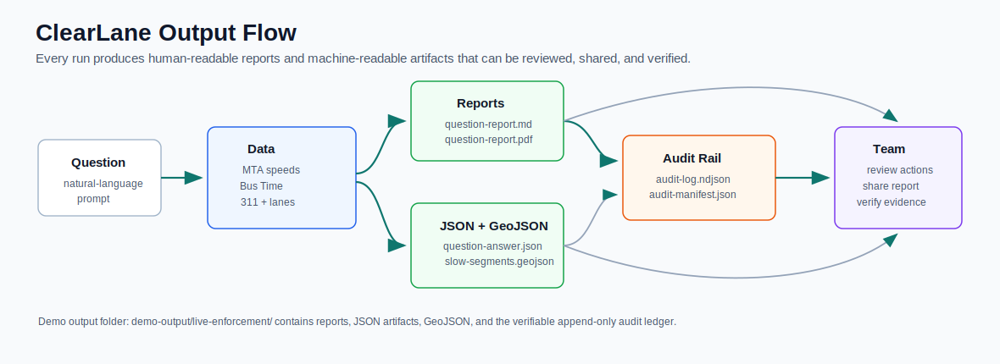
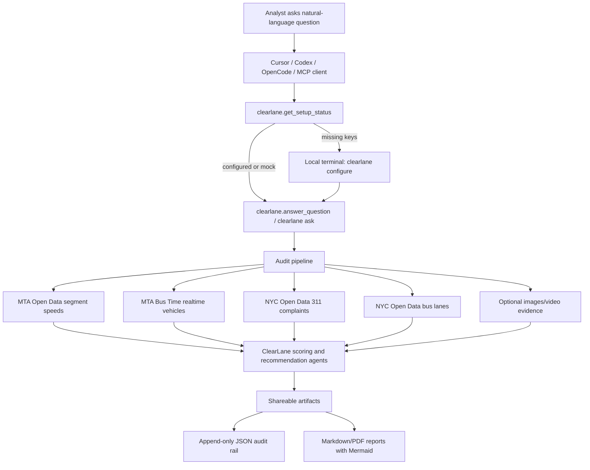

# ClearLane MCP Architecture

NYC buses serve 1.1M+ daily riders, yet 186 of 332 bus lines received D/F grades for speed, bunching, and on-time performance; MTA also notes buses are slowed by double-parking, delivery vehicles, road closures, and traffic.

Today, analysts manually stitch together MTA data, NYC Open Data, 311 complaints, maps, and field evidence; ClearLane MCP turns those disconnected sources into an audit-ready reliability report with bottlenecks, likely causes, evidence, recommendations, and append-only JSON logs.





## Mermaid Source

GitHub renders this diagram natively. The npm package page uses the static SVGs above because npm currently displays Mermaid source as plain text.



## Demo Question

```text
Bus speeds are negatively impacted by cars parked in bus lanes and other bus lane obstructions. NYPD has finite resources to enforce traffic laws. How can we use cameras and other technology to conduct more targeted enforcement or automated enforcement?
```

## Demo Command

```bash
clearlane ask "Bus speeds are negatively impacted by cars parked in bus lanes and other bus lane obstructions. NYPD has finite resources to enforce traffic laws. How can we use cameras and other technology to conduct more targeted enforcement or automated enforcement?" --route M15 --borough Manhattan --period weekday_am --out ./demo-output/live-enforcement
```

## Expected Demo Artifacts

```text
demo-output/live-enforcement/
  question-answer.json
  question-report.md
  question-report.pdf
  context-cache.json
  report.md
  report.pdf
  metrics.json
  route-health.json
  slow-segments.geojson
  recommendations.json
  audit-log.ndjson
  audit-manifest.json
```

## Pitch Line

ClearLane turns scattered MTA, Bus Time, NYC Open Data, 311, and optional camera evidence into an audit-ready action plan for targeted bus reliability interventions.
